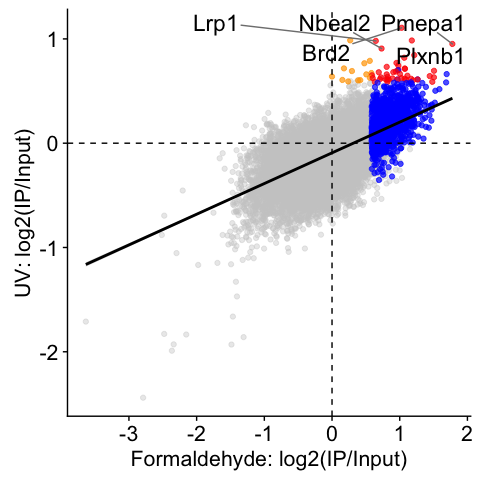

RIP-seq enrichment
================

``` r
library(ggplot2)
library(cowplot)
library(ggrepel)
library(DESeq2)
library(fdrtool)
```

# 1\. Import data

### Sample sheet

``` r
sampleSheet <- read.table("sampleSheet2.txt", sep="\t", header=T, stringsAsFactors = F)
```

### Annotation

``` r
gencode <- read.table("gencode_vM16_parsed_gene.txt", header=T, sep="\t", stringsAsFactors = F)
```

### Count file

``` r
fCounts.preRNA <- read.table("fCounts2_table.txt", header=T, sep="\t", stringsAsFactors = F)
```

# 2\. Tidy data

### fCounts to table

``` r
fCounts.annot <- fCounts.preRNA[, c(1,2)]
colnames(fCounts.annot) <- c("gene_id", "preRNA_length")

fCounts.preRNA <- fCounts.preRNA[, -c(1,2)]
rownames(fCounts.preRNA) <- fCounts.annot$gene_id
```

# 3\. Enrichment

### Functions

``` r
calEnrich2 <- function(sampleSheet, countMatrix, designFormula, normVector, count_th_fun="max", count_th_arg=3) {
  tempCount <- countMatrix[, match(sampleSheet$Sample, colnames(countMatrix))]
  rownames(sampleSheet) <- sampleSheet$Sample
  
  deseq2.obj <- DESeqDataSetFromMatrix(countData=tempCount, colData=sampleSheet , design=formula(designFormula))
  sizeFactors(deseq2.obj) <- normVector/min(normVector)
  deseq2.obj <- DESeq(deseq2.obj[apply(counts(deseq2.obj),1,get(count_th_fun))>=count_th_arg,])
  
  print(paste("List of the coefficients:", paste(resultsNames(deseq2.obj), collapse=", ")))
  print("Testing: LibraryPulldown VS. LibraryInput")
  output <- results(deseq2.obj, contrast=c("Library", "Pulldown","Input"))

  return(output)
}
```

  - This function performs enrichment calculation using DESeq2 for
    design.
  - Input design should be a form of " ~ Covariates + Library".
  - Input sampleSheet should have a column of “Library” consisting of
    “Input” and “Pulldown”.

<!-- end list -->

``` r
assignEmpPvalue <- function(input) {
  temp <- fdrtool(input$stat, statistic= "normal", plot = F)
  input$pvalue=temp$pval
  input$padj=temp$qval
  return(input)
}
```

  - P-value based on empirical estimation of variation

### Initialization

``` r
enrich.preRNA <- list()
```

### Samples with UV-crosslinking

DESeq2

``` r
tempSheet <- subset(sampleSheet, Crosslink=="UV")
tempSheet$Library <- factor(tempSheet$Library, levels=c("Input", "IP"), labels=c("Input", "Pulldown"))
enrich.preRNA[["uv"]] <- calEnrich2(tempSheet, fCounts.preRNA, " ~ Replicate + Library", normVector=tempSheet$DeduppedReadPair)
```

    ## Warning in DESeqDataSet(se, design = design, ignoreRank): some variables in
    ## design formula are characters, converting to factors

    ## [1] "List of the coefficients: Intercept, ReplicateUV3, ReplicateUV4, ReplicateUV5, ReplicateUV6, LibraryInput, LibraryPulldown"
    ## [1] "Testing: LibraryPulldown VS. LibraryInput"

Assign empirical p-value

``` r
enrich.preRNA[["uv"]] <- assignEmpPvalue(enrich.preRNA[["uv"]])
```

    ## Step 1... determine cutoff point
    ## Step 2... estimate parameters of null distribution and eta0
    ## Step 3... compute p-values and estimate empirical PDF/CDF
    ## Step 4... compute q-values and local fdr

### Samples with formaldehyde-crosslinking

DESeq2

``` r
tempSheet <- subset(sampleSheet, Crosslink=="Formaldehyde")
tempSheet$Library <- factor(tempSheet$Library, levels=c("Input", "IP"), labels=c("Input", "Pulldown"))
enrich.preRNA[["ch2o"]] <- calEnrich2(tempSheet, fCounts.preRNA, " ~ Replicate + Library", normVector=tempSheet$DeduppedReadPair)
```

    ## Warning in DESeqDataSet(se, design = design, ignoreRank): some variables in
    ## design formula are characters, converting to factors

    ## [1] "List of the coefficients: Intercept, ReplicateF3, ReplicateF4, ReplicateF5, ReplicateF6, LibraryInput, LibraryPulldown"
    ## [1] "Testing: LibraryPulldown VS. LibraryInput"

Assign empirical p-value

``` r
enrich.preRNA[["ch2o"]] <- assignEmpPvalue(enrich.preRNA[["ch2o"]])
```

    ## Step 1... determine cutoff point
    ## Step 2... estimate parameters of null distribution and eta0
    ## Step 3... compute p-values and estimate empirical PDF/CDF
    ## Step 4... compute q-values and local fdr

### Enrichment table

``` r
enrich.table <- gencode

for (i in c("log2FoldChange", "stat", "pvalue", "padj")) {
  res <- as.data.frame(enrich.preRNA[["uv"]])
  enrich.table[, paste("uv", i, sep=".")] <- res[match(enrich.table$gene_id, rownames(res)), i]
  res <- as.data.frame(enrich.preRNA[["ch2o"]])
  enrich.table[, paste("ch2o", i, sep=".")] <- res[match(enrich.table$gene_id, rownames(res)), i]
}

enrich.table <- subset(enrich.table, !is.na(uv.stat) | !is.na(ch2o.stat))
dim(enrich.table)
```

    ## [1] 22936    15

# 4\. Analysis

### The number of enriched genes

``` r
enrich.table$sig <- "Insig"
enrich.table$sig[which(enrich.table$uv.padj<0.05 & enrich.table$uv.log2FoldChange>log2(1.5))] <- "UV_only"
enrich.table$sig[which(enrich.table$ch2o.padj<0.05 & enrich.table$ch2o.log2FoldChange>log2(1.5))] <- "Formaldehyde_only"
enrich.table$sig[which(enrich.table$uv.padj<0.05 & enrich.table$ch2o.padj<0.05 & enrich.table$uv.log2FoldChange>log2(1.5) & enrich.table$ch2o.log2FoldChange>log2(1.5))] <- "Both"
enrich.table$sig <- factor(enrich.table$sig, levels=c("Insig", "Formaldehyde_only", "UV_only", "Both"))

table(enrich.table$sig)
```

    ## 
    ##             Insig Formaldehyde_only           UV_only              Both 
    ##             21913               969                13                41

### Correlation between UV and Formaldehyde

``` r
temp <- subset(enrich.table, !is.na(uv.stat) & !is.na(ch2o.stat))
temp <- temp[order(temp$uv.log2FoldChange, decreasing = T), ]
temp$label <- ""
idx <- which(temp$sig=="Both")[1:5]
temp$label[idx] <- temp$gene_name[idx]

p <- ggplot(subset(temp, sig!="Insig"), aes(x=ch2o.log2FoldChange, y=uv.log2FoldChange, label=label, col=sig))
p <- p + geom_point(data=subset(temp, sig=="Insig"), col="gray80", alpha=0.4)
p <- p + geom_point(alpha=0.7)
p <- p + geom_smooth(data=temp, method="lm", col="black")
p <- p + geom_hline(yintercept=0, linetype="dashed") + geom_vline(xintercept=0, linetype="dashed")
p <- p + scale_color_manual(name="Significance", values=c("blue", "orange","red"))
p <- p + geom_text_repel(col="black", segment.color="grey50", size=6, force = 20)
p <- p + theme(axis.title = element_text(size=16), axis.text=element_text(size=16))
p <- p + theme(legend.position="none")
p <- p + xlab("Formaldehyde: log2(IP/Input)") + ylab("UV: log2(IP/Input)") 
p
```

<!-- -->

### Fisher exact test

``` r
enrich.table$uv.enrich <- "None"
enrich.table$uv.enrich[which(enrich.table$uv.padj<0.05 & enrich.table$uv.log2FoldChange>log2(1.5))] <- "Enrich"
enrich.table$ch2o.enrich <- "None"
enrich.table$ch2o.enrich[which(enrich.table$ch2o.padj<0.05 & enrich.table$ch2o.log2FoldChange>log2(1.5))] <- "Enrich"
table(enrich.table$uv.enrich, enrich.table$ch2o.enrich, dnn=c("UV", "Formaldehyde"))
```

    ##         Formaldehyde
    ## UV       Enrich  None
    ##   Enrich     41    13
    ##   None      969 21913

``` r
fisher.test(table(enrich.table$uv.enrich, enrich.table$ch2o.enrich, dnn=c("UV", "Formaldehyde"))
)
```

    ## 
    ##  Fisher's Exact Test for Count Data
    ## 
    ## data:  
    ## p-value < 2.2e-16
    ## alternative hypothesis: true odds ratio is not equal to 1
    ## 95 percent confidence interval:
    ##   37.31375 145.33755
    ## sample estimates:
    ## odds ratio 
    ##   71.20311

# 5\. R session

``` r
sessionInfo()
```

    ## R version 3.3.3 (2017-03-06)
    ## Platform: x86_64-apple-darwin13.4.0 (64-bit)
    ## Running under: macOS  10.14.6
    ## 
    ## locale:
    ## [1] en_US.UTF-8/en_US.UTF-8/en_US.UTF-8/C/en_US.UTF-8/en_US.UTF-8
    ## 
    ## attached base packages:
    ## [1] parallel  stats4    stats     graphics  grDevices utils     datasets 
    ## [8] methods   base     
    ## 
    ## other attached packages:
    ##  [1] fdrtool_1.2.15             DESeq2_1.14.1             
    ##  [3] SummarizedExperiment_1.4.0 Biobase_2.34.0            
    ##  [5] GenomicRanges_1.26.4       GenomeInfoDb_1.10.3       
    ##  [7] IRanges_2.8.2              S4Vectors_0.12.2          
    ##  [9] BiocGenerics_0.20.0        ggrepel_0.7.0             
    ## [11] cowplot_0.9.2              ggplot2_2.2.1             
    ## 
    ## loaded via a namespace (and not attached):
    ##  [1] bit64_0.9-7          splines_3.3.3        Formula_1.2-3       
    ##  [4] latticeExtra_0.6-28  blob_1.2.1           yaml_2.2.1          
    ##  [7] pillar_1.4.3         RSQLite_2.2.0        backports_1.1.2     
    ## [10] lattice_0.20-35      digest_0.6.25        RColorBrewer_1.1-2  
    ## [13] XVector_0.14.1       checkmate_1.8.5      colorspace_1.4-1    
    ## [16] htmltools_0.4.0      Matrix_1.2-12        plyr_1.8.4          
    ## [19] XML_3.99-0.3         pkgconfig_2.0.3      genefilter_1.56.0   
    ## [22] zlibbioc_1.20.0      xtable_1.8-4         scales_1.1.0        
    ## [25] BiocParallel_1.8.2   htmlTable_1.13.3     tibble_2.1.3        
    ## [28] annotate_1.52.1      farver_2.0.3         nnet_7.3-12         
    ## [31] lazyeval_0.2.2       survival_2.40-1      magrittr_1.5        
    ## [34] crayon_1.3.4         memoise_1.1.0        evaluate_0.14       
    ## [37] foreign_0.8-69       tools_3.3.3          data.table_1.10.4-3 
    ## [40] lifecycle_0.1.0      stringr_1.4.0        locfit_1.5-9.1      
    ## [43] munsell_0.5.0        cluster_2.0.6        AnnotationDbi_1.36.2
    ## [46] rlang_0.4.5          grid_3.3.3           RCurl_1.95-4.10     
    ## [49] rstudioapi_0.11      htmlwidgets_1.5.1    labeling_0.3        
    ## [52] bitops_1.0-6         base64enc_0.1-3      rmarkdown_2.1       
    ## [55] gtable_0.3.0         DBI_1.1.0            R6_2.4.1            
    ## [58] gridExtra_2.3        knitr_1.28           bit_1.1-15.2        
    ## [61] Hmisc_4.1-1          stringi_1.4.6        Rcpp_0.12.14        
    ## [64] vctrs_0.2.3          geneplotter_1.52.0   rpart_4.1-11        
    ## [67] acepack_1.4.1        xfun_0.12
